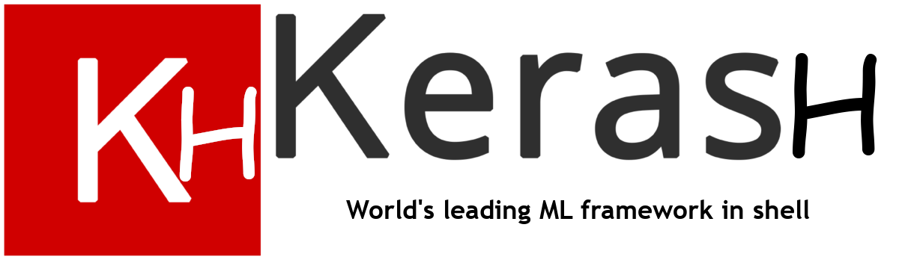

# KeraSH
KeraSH is a shell-based neural network toolkit. KeraSH was implemented
using beer-based programming and is distributed under the Beerware license.

## Using KeraSH
### Requirements
- KeraSH run only on `zsh`
- Being brave enough to use it

### Running tests
A simple `make check` is all you need to run KeraSH's tests.

### Running KeraSH
Here is the most simple way to run KeraSH:
```console
$ # Source KeraSH
$ source ./kera.sh

$ # Init a filesystem for our project
$ init_fs

$ # Loading configuration and datafile into KeraSH
$ store_model "xor" ../test_data/test_model ../test_data/test_data ../test_data/test_label

$ # Compiling the model from configuration
$ create_genome "xor" "${MODEL}/xor.model"

$ # Training our Neural Network
$ fit 1000 "xor" 4 4 10 0.1
```

### What can KeraSH do?

KeraSH has several interesting features:
- Train and evaluate FFN
- Evolve your topology of FFN to optimize training performance
- Evaluate CNN
- Expose a BLAS that allows you to manipulate matrix and 3D tensors with ZSH

## Internals of KeraSH
You can get the slides of our KeraSH's lightning talk on [the LSE Website](https://lse.epita.fr/data/lt/2019-04-09/lt-2019-04-09-jean-adrien-ducastaing--audran-doublet--kerash.pdf)

## Authors
- Jean-Adrien Ducastaing <ducast_j@lse.epita.fr>
- Audran Doublet <audran.doublet@lse.epita.fr>
